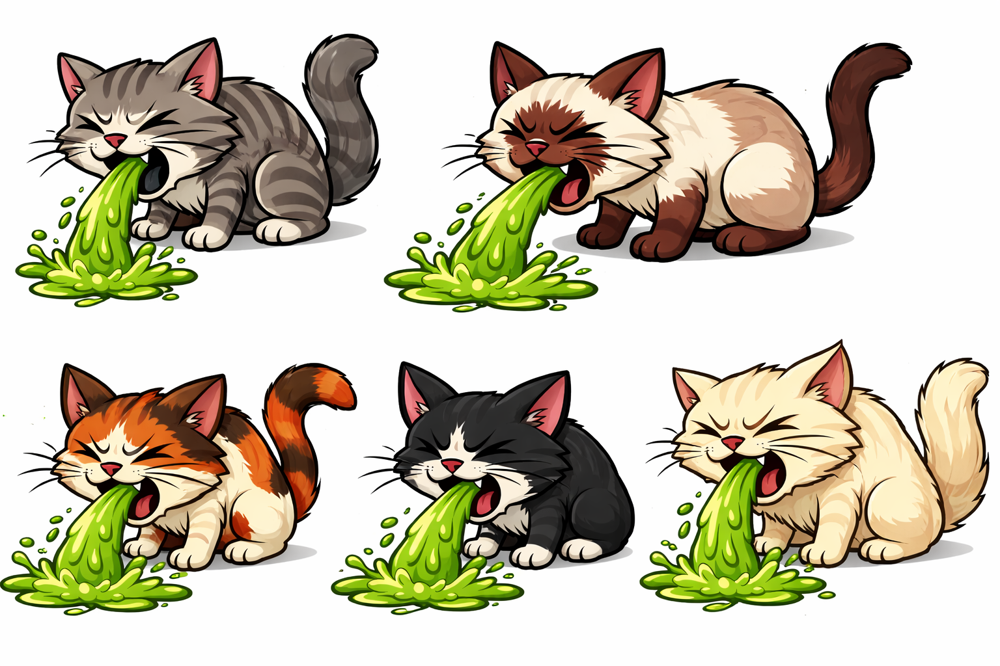
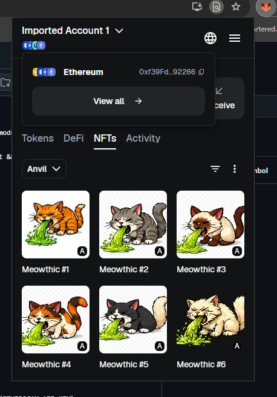

# Meowthic NFT

I am a little late to the game with NFTs, but I have always been curious about going through the entire process of creating an NFT from scratch. Here is my MEOWTHIC NFT. The images were generated by ChatGPT and uploaded to IPFS via Pinata, making them globally accessible.

## Deploying to Anvil
To play around:
```
forge install
<run anvil in a separate terminal>
forge deploy
forge mint
```
`Interactions.s.sol` script will deploy all 6 puking cats to Anvil.
The `Interactions.s.sol` script will deploy all 6 Puking Cats to Anvil. Just import the first test wallet from Anvil, add Anvil to Metamask, and then you can import these NFTs one by one. Their IDs are 0, 1, 2, 3, 4, and 5, respectively.

Not sure why I did this. I guess, for fun only. Here is the result in my Metamask:

